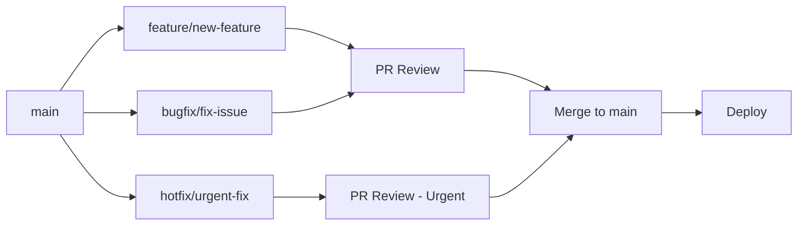

# Branch Naming Convention Guide

This document defines the branch naming strategy and conventions for the PinkFlow repository.

---

## 📋 Table of Contents

- [Overview](#overview)
- [Branch Types](#branch-types)
- [Naming Format](#naming-format)
- [Branch Lifecycle](#branch-lifecycle)
- [Visual Branch Strategy](#visual-branch-strategy)
- [Examples](#examples)
- [Best Practices](#best-practices)

---

## 🌟 Overview

PinkFlow follows a structured branch naming convention to maintain clarity and organization across development, especially important given the ecosystem's multiple components (DeafAuth, FibonRose, PinkSync, 360Magicians, etc.).

### Why Branch Naming Matters

- **Clarity**: Instantly understand the purpose of a branch
- **Organization**: Easy filtering and searching
- **Automation**: Enable CI/CD rules based on branch patterns
- **Collaboration**: Team members know what's being worked on
- **History**: Clean git history with meaningful branch names

---

## 🌿 Branch Types

### Main Branches (Permanent)

#### `main`
- **Purpose**: Production-ready code
- **Protection**: Highly protected, requires reviews
- **Merges From**: `release/*` branches only
- **Never**: Direct commits

#### `develop` (Optional)
- **Purpose**: Integration branch for features
- **Protection**: Protected, requires reviews
- **Merges From**: `feature/*`, `bugfix/*`, `refactor/*`
- **When Used**: For complex projects needing pre-release integration

### Temporary Branches

#### Feature Branches
- **Prefix**: `feature/`
- **Purpose**: New features or enhancements
- **Base**: `main` or `develop`
- **Lifetime**: Until feature complete and merged
- **Example**: `feature/deaf-auth-integration`

#### Bug Fix Branches
- **Prefix**: `bugfix/`
- **Purpose**: Non-urgent bug fixes
- **Base**: `main` or `develop`
- **Lifetime**: Until fix merged
- **Example**: `bugfix/login-validation-error`

#### Hotfix Branches
- **Prefix**: `hotfix/`
- **Purpose**: Critical production bugs
- **Base**: `main`
- **Merge To**: Both `main` and `develop`
- **Lifetime**: Immediate, urgent fixes
- **Example**: `hotfix/security-vulnerability-fix`

#### Release Branches
- **Prefix**: `release/`
- **Purpose**: Prepare for production release
- **Base**: `develop` or `main`
- **Format**: `release/v{version}`
- **Lifetime**: Until release deployed
- **Example**: `release/v0.2.0`

#### Documentation Branches
- **Prefix**: `docs/`
- **Purpose**: Documentation updates
- **Base**: `main`
- **Lifetime**: Until docs merged
- **Example**: `docs/update-api-reference`

#### Refactor Branches
- **Prefix**: `refactor/`
- **Purpose**: Code refactoring without feature changes
- **Base**: `main` or `develop`
- **Lifetime**: Until refactor complete
- **Example**: `refactor/workflow-engine-optimization`

#### Test Branches
- **Prefix**: `test/`
- **Purpose**: Adding or updating tests
- **Base**: `main` or `develop`
- **Lifetime**: Until tests merged
- **Example**: `test/add-unit-tests-auth`

#### Chore Branches
- **Prefix**: `chore/`
- **Purpose**: Maintenance, dependencies, CI/CD
- **Base**: `main`
- **Lifetime**: Until task complete
- **Example**: `chore/update-dependencies`

#### Experimental Branches
- **Prefix**: `experiment/`
- **Purpose**: Proof of concepts, experiments
- **Base**: Any
- **Lifetime**: Temporary, may be deleted
- **Example**: `experiment/ai-workflow-automation`

---

## 📝 Naming Format

### Standard Format

```
<type>/<scope>-<short-description>
```

### Components

1. **Type**: Branch category (see types above)
2. **Scope** (optional): Component or area affected
3. **Short Description**: Kebab-case description

### Format Rules

- **Use lowercase**: All letters lowercase
- **Use hyphens**: Separate words with hyphens (kebab-case)
- **Be descriptive**: Clear, concise description of purpose
- **Keep it short**: Aim for 3-5 words in description
- **No special characters**: Only letters, numbers, hyphens, forward slashes
- **Include issue number** (optional): `feature/123-add-new-feature`

---

## 🎯 Naming Format Examples

### Good Names ✅

```bash
feature/deaf-auth-integration
feature/360-sign-language-feedback
bugfix/workflow-validation-error
bugfix/42-fix-login-timeout
hotfix/security-patch-xss
release/v0.2.0
docs/update-contributing-guide
refactor/simplify-auth-flow
test/add-workflow-tests
chore/update-github-actions
experiment/ai-code-review
```

### Bad Names ❌

```bash
new-feature                    # Missing type prefix
feature/new_feature            # Use hyphens, not underscores
Feature/NewFeature             # Don't use capitals
feature/this-is-a-very-long-description-of-what-im-doing  # Too long
fix                            # Not descriptive enough
john-dev-branch                # Not describing the work
temp                           # Not meaningful
```

---

## 🔄 Branch Lifecycle

### 1. Creation

```bash
# From main branch
git checkout main
git pull origin main

# Create your branch
git checkout -b feature/your-feature-name
```

### 2. Development

```bash
# Make changes
git add .
git commit -m "feat: implement feature functionality"

# Push to remote
git push -u origin feature/your-feature-name
```

### 3. Keep Updated

```bash
# Regularly sync with main
git checkout main
git pull origin main
git checkout feature/your-feature-name
git merge main

# Or use rebase
git rebase main
```

### 4. Pull Request

- Create PR when work is ready
- Use PR template
- Link related issues
- Request reviews

### 5. Merge & Cleanup

```bash
# After merge, delete branch
git checkout main
git pull origin main
git branch -d feature/your-feature-name

# Delete remote branch (if not auto-deleted)
git push origin --delete feature/your-feature-name
```

---

## 📊 Visual Branch Strategy

```
main (production)
 │
 ├── release/v0.2.0
 │    │
 │    ├── feature/backend-integration
 │    ├── feature/real-time-sync
 │    └── bugfix/api-error-handling
 │
 ├── feature/deaf-auth-sso
 │    │
 │    └── experiment/oauth-flow
 │
 ├── feature/fibonrose-trust-engine
 │
 ├── docs/update-onboarding
 │
 ├── hotfix/critical-security-fix
 │
 └── chore/dependency-updates
```

### Workflow Visualization



---

## 🎯 Component-Specific Branches

For PinkFlow's ecosystem components, consider adding scope:

### DeafAuth Component
```bash
feature/deafauth-oauth-integration
bugfix/deafauth-token-refresh
refactor/deafauth-session-management
```

### FibonRose Component
```bash
feature/fibonrose-trust-scoring
bugfix/fibonrose-validation-logic
test/fibonrose-governance-tests
```

### PinkSync Component
```bash
feature/pinksync-websocket-server
bugfix/pinksync-connection-stability
refactor/pinksync-event-handling
```

### 360Magicians Component
```bash
feature/magicians-ai-workflow
bugfix/magicians-api-integration
experiment/magicians-gemini-proxy
```

### Workflow System
```bash
feature/workflow-conditional-routing
bugfix/workflow-node-execution
refactor/workflow-builder-api
```

---

## 🏷️ Branch Protection Rules

### `main` Branch
- ✅ Require pull request reviews (2+)
- ✅ Require status checks to pass
- ✅ Require branches to be up to date
- ✅ Require conversation resolution
- ✅ Require signed commits (optional)
- ❌ No direct pushes
- ❌ No force pushes
- ❌ No deletions

### `release/*` Branches
- ✅ Require pull request reviews (1+)
- ✅ Require status checks
- ❌ No force pushes

### `develop` Branch (if used)
- ✅ Require pull request reviews (1+)
- ✅ Require status checks
- ✅ Allow force push (with lease)

---

## 💡 Best Practices

### DO ✅

1. **Create branch from updated main**
   ```bash
   git checkout main
   git pull
   git checkout -b feature/your-feature
   ```

2. **Use descriptive names**
   - `feature/add-sign-language-video-upload` ✅
   - Not: `feature/video` ❌

3. **Keep branches focused**
   - One feature or fix per branch
   - Easier to review and merge

4. **Delete merged branches**
   - Keep repository clean
   - Avoid confusion

5. **Regular updates from main**
   - Minimize merge conflicts
   - Stay current with changes

6. **Link to issues**
   - `feature/123-implement-oauth` ✅
   - Provides context

### DON'T ❌

1. **Don't commit directly to main**
   - Always use pull requests
   - Maintain review process

2. **Don't use personal names**
   - `john-work` ❌
   - Describe the work, not the person

3. **Don't create long-lived branches**
   - Merge frequently
   - Reduce integration problems

4. **Don't use vague names**
   - `fix-bugs` ❌
   - `temp-branch` ❌

5. **Don't mix concerns**
   - Keep feature work separate from refactoring
   - One purpose per branch

---

## 🔍 Finding Branches

### List all feature branches
```bash
git branch -a | grep feature/
```

### List all branches for a component
```bash
git branch -a | grep deafauth
```

### Search by issue number
```bash
git branch -a | grep "42-"
```

---

## 🔧 CI/CD Integration

Branches can trigger different CI/CD workflows:

```yaml
# Example GitHub Actions workflow trigger
on:
  push:
    branches:
      - main
      - 'release/**'
      - 'feature/**'
      - 'bugfix/**'
      - 'hotfix/**'
```

---

## 📚 Quick Reference

| Branch Type | Prefix | Base | Example |
|------------|--------|------|---------|
| Feature | `feature/` | main | `feature/oauth-login` |
| Bug Fix | `bugfix/` | main | `bugfix/form-validation` |
| Hot Fix | `hotfix/` | main | `hotfix/security-patch` |
| Release | `release/` | main | `release/v1.0.0` |
| Documentation | `docs/` | main | `docs/api-guide` |
| Refactor | `refactor/` | main | `refactor/auth-module` |
| Test | `test/` | main | `test/integration-tests` |
| Chore | `chore/` | main | `chore/update-deps` |
| Experiment | `experiment/` | any | `experiment/new-tech` |

---

## 🎓 Training Scenarios

### Scenario 1: Adding a New Feature

```bash
# 1. Start from main
git checkout main
git pull origin main

# 2. Create feature branch
git checkout -b feature/add-video-feedback

# 3. Make changes and commit
git add .
git commit -m "feat: add video feedback upload"

# 4. Push to remote
git push -u origin feature/add-video-feedback

# 5. Create PR on GitHub
# 6. After approval and merge, delete branch
git checkout main
git pull origin main
git branch -d feature/add-video-feedback
```

### Scenario 2: Fixing a Production Bug

```bash
# 1. Create hotfix from main
git checkout main
git pull origin main
git checkout -b hotfix/fix-login-crash

# 2. Make fix
git add .
git commit -m "fix: resolve login crash on invalid input"

# 3. Push and create urgent PR
git push -u origin hotfix/fix-login-crash

# 4. After expedited review, merge and deploy
```

### Scenario 3: Preparing a Release

```bash
# 1. Create release branch
git checkout main
git pull origin main
git checkout -b release/v0.2.0

# 2. Update version numbers, changelog
git add .
git commit -m "chore: prepare v0.2.0 release"

# 3. Test and fix any issues
# 4. Merge to main and tag
git checkout main
git merge release/v0.2.0
git tag -a v0.2.0 -m "Release v0.2.0"
git push origin main --tags
```

---

## 🌍 PinkFlow Ecosystem Considerations

Given PinkFlow's Deaf-First approach and multiple components:

1. **Accessibility Branches**: Consider `a11y/` prefix for accessibility improvements
2. **Component Clarity**: Use component names in branch descriptions
3. **Sign Language Features**: Be specific about Deaf-First features
4. **Integration Branches**: When working across components, mention both

### Example:
```bash
feature/deafauth-pinksync-integration
a11y/improve-screen-reader-support
feature/sign-language-video-processing
```

---

## 📞 Questions?

Refer to:
- [CONTRIBUTING.md](CONTRIBUTING.md) - Contribution guidelines
- [README.md](README.md) - Project overview
- [GitHub Issues](https://github.com/pinkycollie/pinkflow/issues) - Ask questions

---

**Last Updated**: 2025-12-03  
**Part of the PinkFlow Deaf-First Innovation Ecosystem**
