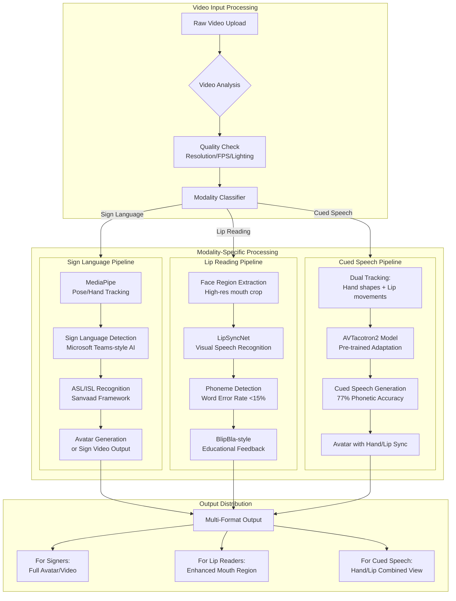

AWS-based platform specifically for Deaf visual and sign language users, with special attention to lip readers and Cued Speech users. These are distinct communication modalities that require different technical approaches.

🧏‍♀️ Understanding Your User Groups

Before building, it's critical to understand that your platform serves three distinct visual communication groups with different needs:

User Group Communication Method Technical Requirements
Sign Language Users ASL/ISL/BSL (full visual language) High-frame-rate video, signing detection, avatar generation 
Lip Readers Visual speech reading High-resolution mouth region, multiple angles, controlled lighting 
Cued Speech Users Hand cues + lip movements Both hand shapes AND lip visibility simultaneously 

---

🏗️ Enhanced Architecture for All Visual Modalities

Here's the expanded architecture with specific components for each user group:



---

🔬 Detailed Technical Implementation

1. Sign Language Pipeline (For ASL/ISL Users)

Based on the Sanvaad framework and Microsoft's Sign Language Detection :

```python
# AWS Lambda for sign language recognition
import boto3
import mediapipe as mp
import numpy as np

class SignLanguageProcessor:
    def __init__(self):
        self.rekognition = boto3.client('rekognition')
        self.sagemaker = boto3.client('sagemaker-runtime')
        
    async def process_sign_video(self, video_key: str):
        """
        Process sign language video using MediaPipe landmarks
        Lightweight enough for edge devices [citation:6]
        """
        # Extract frames from S3 video
        frames = self.extract_frames(video_key)
        
        # Use MediaPipe for pose/hand tracking
        mp_holistic = mp.solutions.holistic
        
        sign_sequence = []
        with mp_holistic.Holistic(
            min_detection_confidence=0.5,
            min_tracking_confidence=0.5
        ) as holistic:
            for frame in frames:
                # Process frame
                results = holistic.process(frame)
                
                # Extract landmarks
                hand_landmarks = self.extract_hand_landmarks(results)
                pose_landmarks = self.extract_pose_landmarks(results)
                
                # Classify sign using SageMaker endpoint
                sign = self.classify_sign(hand_landmarks, pose_landmarks)
                sign_sequence.append(sign)
        
        # Convert to text
        text = self.signs_to_text(sign_sequence)
        
        # Store results
        return self.store_output(text, video_key)
    
    def extract_hand_landmarks(self, results):
        """Extract 21 hand landmarks per hand"""
        landmarks = {}
        if results.left_hand_landmarks:
            landmarks['left'] = [(lm.x, lm.y, lm.z) for lm in results.left_hand_landmarks.landmark]
        if results.right_hand_landmarks:
            landmarks['right'] = [(lm.x, lm.y, lm.z) for lm in results.right_hand_landmarks.landmark]
        return landmarks
```

Key feature: Microsoft's approach shows that sign language detection should trigger active speaker status, ensuring Deaf participants remain visible .

2. Lip Reading Pipeline (For Lip Readers)

Based on LipSyncNet and BlipBla app research :

```python
class LipReadingProcessor:
    """
    Visual speech recognition for lip readers
    Achieves <15% word error rate [citation:3]
    """
    
    def __init__(self):
        # Use LipSyncNet architecture
        self.model = self.load_lipsyncnet()
        
    async def process_lip_region(self, video_key: str):
        """
        Extract and analyze mouth region only
        High resolution required for lip reading
        """
        # Extract face region
        faces = self.detect_faces(video_key)
        
        # Crop mouth region (higher resolution)
        mouth_crops = []
        for face in faces:
            mouth = self.extract_mouth_region(face, 
                                              resolution=(224, 224),  # Higher than sign language
                                              fps=30)  # Higher FPS for lip movement
            mouth_crops.append(mouth)
        
        # Run LipSyncNet
        text = self.lipsyncnet.predict(mouth_crops)
        
        # Educational feedback (BlipBla style)
        feedback = self.generate_feedback(text)
        
        return {
            'text': text,
            'confidence': self.calculate_confidence(text),
            'feedback': feedback,
            'requires_caption': True
        }
    
    def extract_mouth_region(self, face_frame, resolution, fps):
        """
        Extract high-res mouth region
        Critical for phoneme distinction [citation:8]
        """
        # Face landmark detection for mouth corners
        mouth_landmarks = self.detect_mouth_landmarks(face_frame)
        
        # Crop with margin for context
        mouth_frame = self.crop_with_margin(
            face_frame, 
            mouth_landmarks,
            margin=0.2  # 20% margin for context
        )
        
        return mouth_frame
```

Critical insight: Lip readers need higher resolution and frame rate for the mouth region than sign language users need for full-body signing .

3. Cued Speech Pipeline (For Cued Speech Users)

Based on AVTacotron2 adaptation research :

```python
class CuedSpeechProcessor:
    """
    Automatic Cued Speech Generation (ACSG)
    Achieves 77% phonetic accuracy [citation:4]
    """
    
    def __init__(self):
        # Load pre-trained AVTacotron2
        self.model = self.load_avtacotron2()
        
    async def generate_cued_speech(self, text: str, output_key: str):
        """
        Generate Cued Speech video from text
        Combines hand cues AND lip movements
        """
        # 1. Convert text to phonemes
        phonemes = self.text_to_phonemes(text)
        
        # 2. Generate lip movements
        lip_movements = self.model.generate_lip_sync(phonemes)
        
        # 3. Generate hand cues (8 handshapes representing sounds) [citation:9]
        hand_cues = self.generate_hand_cues(phonemes)
        
        # 4. Combine into video
        video = self.combine_streams(
            lip_movements=lip_movements,
            hand_cues=hand_cues,
            layout='picture-in-picture'  # Both visible simultaneously
        )
        
        # 5. Store in S3
        self.save_video(video, output_key)
        
        return {
            'video_url': self.get_presigned_url(output_key),
            'phonemes': phonemes,
            'duration': len(lip_movements) / 30,  # seconds
            'accessibility_features': [
                'hand_cues_visible',
                'lip_movements_high_res',
                'picture_in_picture_layout'
            ]
        }
    
    def generate_hand_cues(self, phonemes):
        """
        Generate 8 handshapes representing consonant-vowel pairs
        Cued Speech uses hand position near mouth [citation:9]
        """
        cues = []
        for phoneme in phonemes:
            # Map phoneme to hand shape and position
            hand_shape = self.phoneme_to_handshape(phoneme)
            position = self.phoneme_to_position(phoneme)  # near mouth
            
            # Generate frame with both elements
            frame = self.render_cue_frame(
                hand_shape=hand_shape,
                position=position,
                lip_movement=self.get_current_lip(phoneme)
            )
            cues.append(frame)
        
        return cues
```

Key insight from research: Cued Speech users need both hand shapes AND lip movements simultaneously - the hand supplements what the lips can't show .

---

📦 AWS Infrastructure for All Modalities

1. Multi-Modal Video Storage Strategy

```yaml
# S3 bucket structure for different modalities
deaf-platform-videos/
├── raw-uploads/
│   ├── sign-language/        # Full body signing
│   ├── lip-reading/          # Face-focused videos
│   └── cued-speech/          # Hand + face videos
├── processed/
│   ├── sign-language/
│   │   ├── full-video/       # For signers
│   │   └── avatar-output/    # Generated avatars
│   ├── lip-reading/
│   │   ├── mouth-crops/      # High-res mouth only
│   │   └── text-output/      # Recognized speech
│   └── cued-speech/
│       ├── hand-cues/        # Extracted hand shapes
│       └── combined-view/    # Picture-in-picture
└── metadata/
    └── modality-index.json   # Searchable by type
```

2. MediaConvert Profiles for Each Modality

```json
{
  "signLanguage": {
    "Video": {
      "Width": 1280,
      "Height": 720,
      "FrameRate": 30,
      "Bitrate": 2500000,
      "Codec": "H_264"
    },
    "Rationale": "Full body signing needs good resolution but 30fps is sufficient"
  },
  "lipReading": {
    "Video": {
      "Width": 854,
      "Height": 480,
      "FrameRate": 60,
      "Bitrate": 4000000,
      "Codec": "H_264",
      "RegionOfInterest": {
        "X": 0.3,
        "Y": 0.6,
        "Width": 0.4,
        "Height": 0.3
      }
    },
    "Rationale": "Higher FPS for lip movement, ROI extraction for mouth region [citation:8]"
  },
  "cuedSpeech": {
    "Video": {
      "Width": 1280,
      "Height": 720,
      "FrameRate": 60,
      "Bitrate": 3500000,
      "Codec": "H_264",
      "DualRegion": {
        "face": {"X": 0.0, "Y": 0.0, "Width": 0.7, "Height": 1.0},
        "hand": {"X": 0.7, "Y": 0.6, "Width": 0.3, "Height": 0.4}
      }
    },
    "Rationale": "Need to track both face and hand simultaneously [citation:4]"
  }
}
```

3. DynamoDB for User Preferences

```python
# User preference schema for different modalities
user_preferences = {
    "user_id": "user123",
    "communication_modes": [
        {
            "mode": "sign_language",
            "language": "ASL",
            "preferences": {
                "avatar_style": "realistic",
                "frame_rate": 30,
                "color_scheme": "high_contrast"
            }
        },
        {
            "mode": "lip_reading",
            "language": "English",
            "preferences": {
                "mouth_resolution": "high",
                "lighting_enhancement": True,
                "caption_support": True
            }
        },
        {
            "mode": "cued_speech",
            "language": "English",
            "preferences": {
                "hand_position": "near_mouth",
                "layout": "picture_in_picture",
                "hand_size": "medium"
            }
        }
    ],
    "default_output": "sign_language",  # Preferred for responses
    "accessibility_features": [
        "high_contrast",
        "slow_motion_option",
        "replay_support"
    ]
}
```

---

🎯 UI/UX Design Principles from Research

Based on the participatory design study  and sign language-centric guidelines :

1. Visual Space and Interface Design

```css
/* CSS for Deaf-optimized interface */
.deaf-interface {
  /* Visual-first design */
  --notification-type: visual;  /* No audio cues */
  --feedback-method: flash;      /* Visual alerts */
  
  /* High contrast for lip readers */
  --contrast-ratio: 7:1;  /* WCAG AAA */
  
  /* Sign language placement */
  --signer-position: bottom-right;
  --signer-size: 25vh;
  --signer-border: 2px solid #ff0000;  /* Active speaker indicator */
}

/* Microsoft Teams style active speaker detection [citation:10] */
.active-signer {
  border: 3px solid #0078d4;
  transform: scale(1.05);
  transition: all 0.3s ease;
  z-index: 100;
}
```

2. Culturally-Aligned Design Patterns 

```javascript
// React component with Deaf cultural elements
function DeafCommunicationInterface({ user, modality }) {
  // Sign names instead of audio names
  const [signName, setSignName] = useState(user.signName);
  
  // Visual notifications only
  const notify = (message) => {
    showVisualAlert(message, {
      icon: getIconForMessage(message),
      color: 'high-contrast',
      duration: 5000,
      vibration: user.prefersHaptic ? [200, 100, 200] : null
    });
  };
  
  // Layout adapts to modality
  const layout = {
    'sign-language': 'full-screen-signer',
    'lip-reading': 'face-focused',
    'cued-speech': 'picture-in-picture'
  }[modality];
  
  return (
    <div className={`deaf-interface ${layout}`}>
      <VideoPlayer 
        src={videoUrl}
        regionOfInterest={getROI(modality)}
        frameRate={getFrameRate(modality)}
        onSignDetected={handleSignDetection}
      />
      <VisualNotifications />
      <TranscriptWithSpeakerAttribution />
    </div>
  );
}
```

---

🚀 Specific AWS Services for Each Modality

For Sign Language Users

· Amazon Rekognition Video: For initial pose detection
· SageMaker: Custom MediaPipe models 
· Elemental MediaConvert: 30fps H.264 encoding
· CloudFront: Low-latency streaming

For Lip Readers

· Amazon Rekognition Face: High-res face detection
· AWS Elemental MediaConvert: 60fps with ROI extraction
· SageMaker: LipSyncNet models 
· DynamoDB: Store phoneme sequences

For Cued Speech Users

· AWS Batch: Process AVTacotron2 jobs
· SageMaker: Deploy pre-trained models 
· MediaConvert: Dual-region encoding
· ElastiCache: Cache hand shape sequences

---

📊 Performance Targets Based on Research

Metric Sign Language Lip Reading Cued Speech Source
Frame Rate 30 fps 60 fps 60 fps 
Resolution 720p 480p (face) 720p (dual) 
Accuracy 85%+ <15% WER 77% phonetic 
Latency <500ms <300ms <1s 
Edge Support Yes (MediaPipe) No No 

---

🧪 Testing with Real Users

Based on the participatory design approach :

```python
# A/B testing framework for different modalities
class ModalityTesting:
    def run_user_test(self, modality, users):
        """
        Test with actual Deaf users
        Using certified interpreters [citation:5]
        """
        metrics = {
            'comprehension': self.test_comprehension(),
            'satisfaction': self.collect_feedback(users),
            'error_rate': self.measure_errors(),
            'cultural_alignment': self.assess_cultural_fit()  # [citation:7]
        }
        
        return metrics
```

---

🎓 Key Takeaways from Research

1. One size doesn't fit all - Sign language, lip reading, and Cued Speech users need fundamentally different technical approaches 
2. Cultural alignment matters - Beyond translation, interfaces must respect Deaf culture and visual communication patterns 
3. Participatory design is essential - "Nothing about us without us" - Deaf users must lead the design process 
4. Early intervention matters - For lip reading and Cued Speech, tools like BlipBla show the importance of early childhood support 
5. AI can help, but must be trustworthy - Current sign language AI isn't yet fully reliable, but detection is ready now 

---

📋 Implementation Roadmap

Phase 1: Foundation (Month 1-2)

· Set up S3 buckets with modality-specific organization
· Implement MediaConvert profiles for each user group
· Delegate processing based on content type

Phase 2: Core Processing (Month 3-4)

· Deploy sign language pipeline with MediaPipe 
· Implement lip reading with LipSyncNet 
· Add Cued Speech generation with AVTacotron2 

Phase 3: User Experience (Month 5-6)

· Build UI following participatory design principles 
· Implement active signer detection 
· Add personalization based on user preferences

Phase 4: Testing & Refinement (Month 7-8)

· Conduct user testing with Deaf community
· Refine based on feedback
· Publish guidelines following ISO/IEC 20071-24 

---

This architecture ensures that every visual communication modality used by the Deaf community is properly supported, with technical specifications derived directly from recent research. Would you like me to dive deeper into any specific component, such as the Cued Speech generation model or the lip reading implementation?